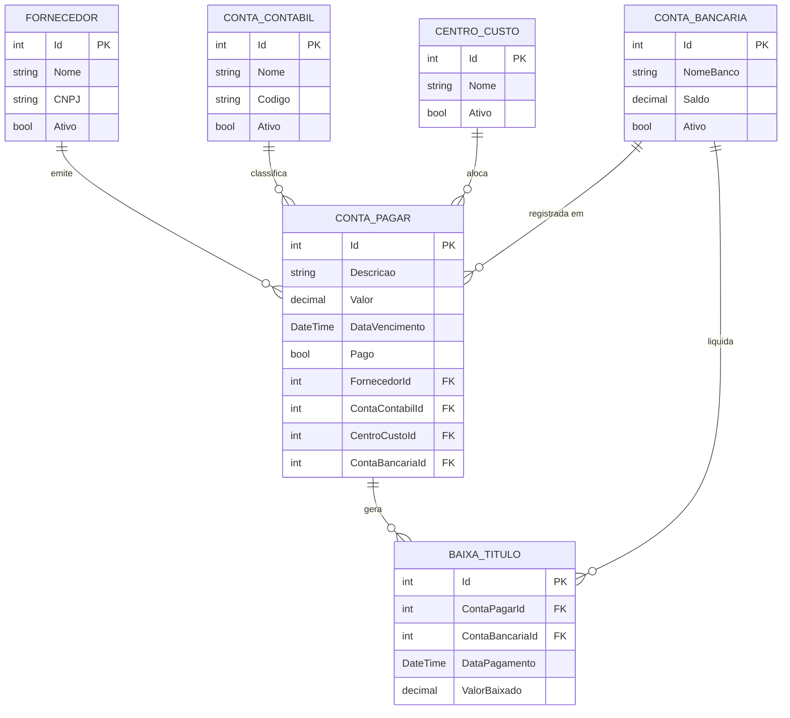

# Crash ERP — Sistema de Gestão de Contas a Pagar (Backend API)

**Participantes:**

- João Felipe Mokdse Costa
- Max Lopes Garcia de Oliveira
- Júlia Helena Buosi Teixeira
- Victor Schernikau Bahia Bittencourt Vieira

**Curso:** Análise e Desenvolvimento de Sistemas
**Universidade:** Universidade Positivo
**Turma:** N2, 3º Período

---

## 📄 Resumo

O **Crash ERP** é uma API especializada na gestão de saídas financeiras, desenvolvida em **.NET 8 (Minimal API)** para automatizar o controle de contas a pagar. O sistema permite que o usuário gerencie saldos bancários de forma manual e realize a liquidação de obrigações financeiras, debitando automaticamente os valores dos saldos correspondentes. Operando sob o padrão REST, a API centraliza o ciclo de vida de fornecedores, classificações contábeis e centros de custo, oferecendo uma interface via **Swagger UI** para execução de baixas individuais e em lote, além de consultas de relatórios parametrizados.

---

## 🚀 Funcionalidades

- **CRUD Completo de Contas a Pagar:** Controle total (listagem geral, busca por ID, criação, edição e remoção física) das obrigações financeiras, com bloqueio de edição e exclusão para títulos já liquidados.
- **Gestão de Entidades de Apoio:** Cadastro e edição de Fornecedores, Contas Contábeis, Centros de Custo e Contas Bancárias. A exclusão é substituída por **inativação lógica**, preservando a rastreabilidade histórica dos lançamentos.
- **Gestão de Saldos Bancários:** Registro e atualização manual de saldos para controle de disponibilidade financeira.
- **Baixa Individual com Débito Automático:** Liquidação de um título informando a conta bancária de origem, com validação de saldo disponível.
- **Baixa em Lote com Débito Automático:** Liquidação simultânea de múltiplos títulos com validação global de saldo antes de processar qualquer débito.
- **Cancelamento de Baixa:** Estorno completo de uma baixa, com devolução automática do valor à conta bancária e reativação do título como pendente.
- **Histórico de Baixas:** Listagem completa e consulta individual de todas as baixas realizadas, com dados do título e da conta bancária.
- **Relatórios Parametrizados:** Consultas filtradas por período de vencimento, status de pagamento, fornecedor, conta contábil e centro de custo, com somatório consolidado de valores pagos e pendentes.

---

## 🛠️ Descrição das Funcionalidades

### 1. Ciclo de Vida das Entidades

O sistema aplica regras distintas para manter a integridade dos dados:

- **Contas a Pagar (CRUD Completo):** Permite a gestão total dos lançamentos de despesas, incluindo listagem geral, busca por ID, criação, edição e exclusão física de registros. Edição e exclusão são bloqueadas caso o título já tenha sido baixado.
- **Entidades de Base (Gestão de Inatividade):** Fornecedores, Contas Contábeis, Centros de Custo e Contas Bancárias possuem rotas de criação e edição. A exclusão é substituída pela **inativação lógica** (campo `Ativo = false`), garantindo que títulos históricos não percam sua rastreabilidade e classificação.

### 2. Baixa de Títulos e Gestão de Saldo

A funcionalidade central do sistema é o processamento de pagamentos. Ao realizar uma baixa (individual ou em lote), o usuário informa a conta bancária de origem. O sistema valida o saldo disponível e realiza o débito do valor do título, marcando a conta como paga e registrando o histórico da transação em `BaixaTitulo`.

Na **baixa em lote**, o saldo total necessário é validado antes de qualquer processamento, evitando débitos parciais inconsistentes.

O **cancelamento de baixa** (`DELETE /api/baixa/{baixaId}`) realiza o estorno completo: devolve o valor à conta bancária, remove o registro de baixa do histórico e recoloca o título como pendente — permitindo que ele seja editado ou baixado novamente.

### 3. Relatórios e Inteligência de Dados

A API implementa uma lógica de filtros avançados no backend. Através do Swagger, o usuário pode parametrizar buscas por intervalo de datas de vencimento, status de pagamento, fornecedor, conta contábil e centro de custo. Todos os parâmetros são opcionais e combináveis. A resposta inclui a lista de títulos filtrados e um resumo consolidado com total pago, total pendente e total geral.

### 4. Integridade e Relacionamentos

Para garantir a qualidade dos dados, o sistema exige que cada conta a pagar esteja vinculada a um **fornecedor ativo**, uma **conta contábil ativa** e um **centro de custo ativo**. Essas validações são realizadas nas rotas de criação e edição, impedindo lançamentos inconsistentes e garantindo a precisão dos somatórios nos relatórios.

---

## 📂 Repositório

O projeto utiliza **C# com SDK 8 (Minimal API)** e **Entity Framework Core** para persistência em **SQLite**. A interação, os testes de rotas e a visualização de relatórios são realizados via **Swagger UI**, acessível diretamente ao iniciar a aplicação.

| Camada | Tecnologia |
|---|---|
| Framework | .NET 8 (Minimal API) |
| ORM | Entity Framework Core 8 |
| Banco de Dados | SQLite (`Crash.db`) |
| Documentação / Testes | Swagger UI (Swashbuckle) |

**Estrutura do projeto:**

```
API-Crash/
├── Crash/
│   ├── Data/
│   │   └── AppDbContext.cs       # Contexto do Entity Framework
│   ├── Migrations/               # Histórico de migrações do banco
│   ├── Models/
│   │   ├── BaixaTitulo.cs        # Registro de baixa
│   │   ├── CentroCusto.cs        # Entidade de apoio
│   │   ├── ContaBancaria.cs      # Conta bancária com saldo
│   │   ├── ContaContabil.cs      # Classificação contábil
│   │   ├── ContaPagar.cs         # Título financeiro (conta a pagar)
│   │   └── Fornecedor.cs         # Fornecedor
│   ├── appsettings.json          # Configuração da connection string
│   ├── Crash.csproj              # Definição do projeto e pacotes
│   └── Program.cs                # Todas as rotas da API (Minimal API)
└── API-Crash.sln
```

---

## 🔗 Endpoints da API

### Fornecedores — `/api/fornecedores`

| Método | Rota | Descrição |
|---|---|---|
| GET | `/api/fornecedores` | Lista todos os fornecedores (ativos e inativos) |
| POST | `/api/fornecedores` | Cadastra um novo fornecedor |
| PUT | `/api/fornecedores/{id}` | Atualiza dados de um fornecedor |
| DELETE | `/api/fornecedores/{id}` | Inativa logicamente um fornecedor |

### Contas Contábeis — `/api/contacontabil`

| Método | Rota | Descrição |
|---|---|---|
| GET | `/api/contacontabil/` | Lista todas as contas contábeis (ativas e inativas) |
| POST | `/api/contacontabil` | Cadastra uma nova conta contábil |
| PUT | `/api/contacontabil/{id}` | Atualiza uma conta contábil |
| DELETE | `/api/contacontabil/{id}` | Inativa logicamente uma conta contábil |

### Centros de Custo — `/api/centrocusto`

| Método | Rota | Descrição |
|---|---|---|
| GET | `/api/centrocusto` | Lista todos os centros de custo (ativos e inativos) |
| POST | `/api/centrocusto` | Cadastra um novo centro de custo |
| PUT | `/api/centrocusto/{id}` | Atualiza um centro de custo |
| DELETE | `/api/centrocusto/{id}` | Inativa logicamente um centro de custo |

### Contas Bancárias — `/api/contabancaria`

| Método | Rota | Descrição |
|---|---|---|
| GET | `/api/contabancaria` | Lista todas as contas bancárias (ativas e inativas) |
| POST | `/api/contabancaria` | Cadastra uma nova conta bancária |
| PUT | `/api/contabancaria/{id}` | Atualiza nome, saldo ou status de uma conta bancária |
| DELETE | `/api/contabancaria/{id}` | Inativa logicamente uma conta bancária |

### Contas a Pagar — `/api/contapagar`

| Método | Rota | Descrição |
|---|---|---|
| GET | `/api/contapagar` | Lista todas as contas a pagar (com relacionamentos) |
| GET | `/api/contapagar/{id}` | Busca uma conta a pagar por ID |
| POST | `/api/contapagar` | Cria uma nova conta a pagar |
| PUT | `/api/contapagar/{id}` | Atualiza uma conta (bloqueado se já paga) |
| DELETE | `/api/contapagar/{id}` | Remove fisicamente uma conta (bloqueado se já paga) |

### Baixas — `/api/baixa`

| Método | Rota | Descrição |
|---|---|---|
| GET | `/api/baixa` | Lista o histórico completo de baixas |
| GET | `/api/baixa/{baixaId}` | Detalha uma baixa específica |
| POST | `/api/baixa/{contaPagarId}` | Realiza baixa individual de um título |
| POST | `/api/baixa/lote` | Realiza baixa em lote de múltiplos títulos |
| DELETE | `/api/baixa/{baixaId}` | Cancela uma baixa e devolve o saldo |

### Relatório — `/api/relatorio`

| Método | Rota | Parâmetros opcionais |
|---|---|---|
| GET | `/api/relatorio` | `dataInicio`, `dataFim`, `pago`, `fornecedorId`, `contaContabilId`, `centroCustoId` |

---

## ▶️ Como Executar

### Backend (API)

**Pré-requisitos:** .NET 8 SDK instalado.

```bash
# 1. Acesse a pasta do projeto
cd Crash

# 2. Restaure as dependências
dotnet restore

# 3. Execute a aplicação
dotnet run
```

A aplicação iniciará e criará o banco de dados automaticamente. Ao acessar o endereço exibido no terminal (ex: `http://localhost:5128`), você será redirecionado automaticamente para a interface do Swagger.

### Frontend

**Pré-requisitos:** Node.js instalado.

```bash
# 1. Acesse a pasta do frontend
cd FrontendCrash

# 2. Instale as dependências
npm install

# 3. Inicie o servidor de desenvolvimento
npm run dev
```

O frontend estará disponível em `http://localhost:5173`. **A API deve estar rodando** em `http://localhost:5128` para que o frontend funcione corretamente.

---

## 🖥️ Frontend

O frontend foi desenvolvido em **React 19 com TypeScript**, utilizando **Vite** como bundler. Consome diretamente a API REST desenvolvida pela equipe via **Axios**.

### Tecnologias

| Item | Tecnologia |
|---|---|
| Framework | React 19 (TypeScript) |
| Bundler | Vite |
| Roteamento | React Router DOM v7 |
| HTTP Client | Axios |
| Estilização | CSS puro com variáveis e sidebar responsiva |

### Estrutura de Telas

O sistema possui navegação lateral (sidebar) com acesso a todas as funcionalidades:

- **Dashboard** — Visão geral com totais de contas a pagar, pagas e pendentes
- **Contas a Pagar** — Listagem, cadastro e edição de títulos financeiros
- **Baixas de Títulos** — Realização de baixas individuais ou em lote, com seleção de conta bancária
- **Relatório** — Consulta parametrizada com filtros por período, status, fornecedor, conta contábil e centro de custo
- **Fornecedores** — Cadastro, edição e inativação
- **Conta Contábil** — Cadastro, edição e inativação
- **Centro de Custo** — Cadastro, edição e inativação
- **Conta Bancária** — Cadastro, edição, atualização de saldo e inativação

### Organização do Código

```
FrontendCrash/
├── src/
│   ├── components/
│   │   ├── pages/
│   │   │   ├── dashboard/
│   │   │   ├── contapagar/
│   │   │   ├── baixa/
│   │   │   ├── relatorio/
│   │   │   ├── fornecedor/
│   │   │   ├── contacontabil/
│   │   │   ├── centrocusto/
│   │   │   └── contabancaria/
│   │   └── DateInput.tsx
│   ├── models/           # Tipagens TypeScript das entidades
│   ├── services/
│   │   └── api.ts        # Configuração do Axios (baseURL da API)
│   ├── App.tsx           # Roteamento principal (BrowserRouter + Routes)
│   ├── App.css           # Estilos globais e sidebar
│   └── main.tsx
└── package.json
```

---

## 🗂️ Diagrama Entidade-Relacionamento



---

## 🤖 Uso de IA

**Ferramenta utilizada:** Gemini Flash (Google)

A IA foi utilizada para apoio no planejamento técnico e na redação da documentação do sistema. Os prompts focaram em:

- **Refinamento do escopo:** Adaptação do modelo de ERP para um sistema focado exclusivamente em Contas a Pagar e gestão manual de saldos bancários.
- **Redação técnica:** Elaboração das seções de resumo e descrição de funcionalidades do README, utilizando terminologia de engenharia de software e gestão financeira.
- **Lógica de negócio:** Planejamento da funcionalidade de baixa em lote integrada ao débito automático em contas bancárias.

**Revisões realizadas pela equipe:**
A equipe revisou toda a documentação para garantir que as funcionalidades descritas, os campos dos modelos e os endpoints listados estivessem alinhados com o código efetivamente implementado. Foi validado que os termos técnicos refletem o funcionamento real do sistema e a utilização exclusiva do Swagger para testes e visualização de respostas.