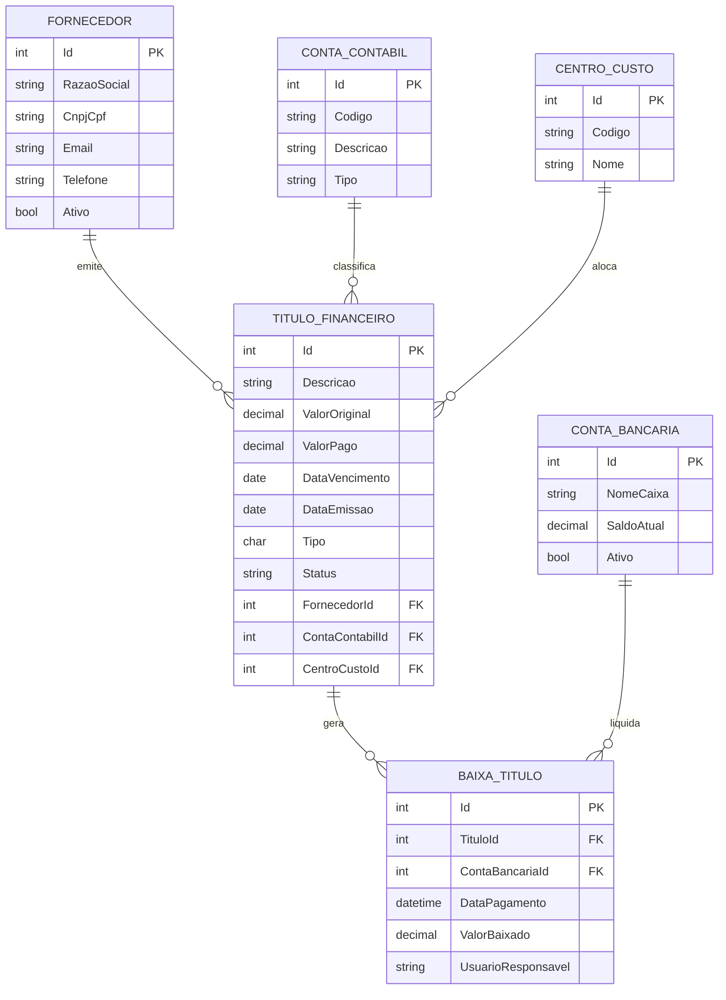

Crash ERP - Sistema de Gestão de Contas a Pagar (Backend API)

Participantes:

João Felipe Mokdse Costa

Max Lopes Garcia de Oliveira

Júlia Helena Buosi Teixeira

Victor Schernikau Bahia Bittencourt Vieira

Curso: Análise e Desenvolvimento de Sistema

Universidade: Universidade Positivo

Turma: N2, 3º Período

📄 Resumo
O Crash ERP é uma API especializada na gestão de saídas financeiras, desenvolvida em .NET 8 para automatizar o controle de contas a pagar. O sistema permite que o usuário gerencie saldos bancários de forma manual e realize a liquidação de obrigações financeiras, debitando automaticamente os valores dos saldos correspondentes. Operando sob o padrão REST, a API centraliza o ciclo de vida de fornecedores, classificações contábeis e centros de custo, oferecendo uma interface via Swagger para execução de baixas em lote e consultas de relatórios parametrizados.

🚀 Funcionalidades
CRUD Completo de Contas a Pagar: Controle total (Inserção, Listagem, Edição e Remoção) das obrigações financeiras.

Gestão de Entidades de Apoio: Cadastro, edição e inativação lógica para Fornecedores, Contas Contábeis e Centros de Custo.

Gestão de Saldos Bancários: Registro e atualização manual de saldos para controle de disponibilidade financeira.

Baixa em Lote com Débito Automático: Liquidação simultânea de múltiplos títulos com abatimento direto no saldo da conta bancária informada.

Relatórios Parametrizados via Swagger: Consultas processadas pelo backend com filtros por período, categoria, fornecedor e status.

Cálculo de Fluxo de Saída: Somatórios de valores pagos e pendentes integrados dinamicamente na resposta JSON das consultas.

🛠️ Descrição das Funcionalidades
1. Ciclo de Vida das Entidades
O sistema aplica regras distintas para manter a integridade dos dados:

Contas a Pagar (CRUD Completo): Permite a gestão total dos lançamentos de despesas, incluindo a exclusão física de registros.

Entidades de Base (Gestão de Inatividade): Fornecedores, Contas Contábeis e Centros de Custo possuem rotas de criação e edição. A exclusão é substituída pela Inativação Lógica, garantindo que títulos históricos não percam sua rastreabilidade e classificação.

2. Baixa de Títulos e Gestão de Saldo
A funcionalidade central do sistema é o processamento de pagamentos. Ao realizar uma baixa (individual ou em lote), o usuário indica a conta bancária de origem. O sistema valida o saldo inserido manualmente e realiza o débito do valor do título, atualizando o status da conta para "Pago" e registrando o histórico da transação.

3. Relatórios e Inteligência de Dados
A API implementa uma lógica de filtros avançados no backend. Através do Swagger, o usuário pode parametrizar buscas complexas. O código processa essas variáveis e retorna não apenas a lista de títulos, mas também o cálculo consolidado dos valores (ex: total pago no período vs. total ainda em aberto), facilitando a visão de saúde financeira.

4. Integridade e Relacionamentos
Para garantir a qualidade dos dados, o sistema exige que cada conta a pagar esteja obrigatoriamente vinculada a um fornecedor e a uma conta contábil ativos. Essas validações impedem lançamentos inconsistentes e garantem a precisão dos somatórios finais.

📂 Repositório
O projeto utiliza C# com SDK 8 (Minimal API) e Entity Framework Core para persistência em SQLite. A interação, testes de rotas e visualização de relatórios são realizados exclusivamente via Swagger UI.

🤖 Uso de IA
Ferramenta Utilizada: Gemini 3 Flash (Google)

Forma de Uso:
A IA foi utilizada para o planejamento técnico e documentação do sistema. Os prompts focaram em:

Refinamento do Escopo: Adaptação do modelo de ERP para um sistema focado exclusivamente em Contas a Pagar e gestão manual de saldos.

Redação Técnica: Elaboração das seções de resumo e descrição de funcionalidades do README, utilizando terminologia de engenharia de software e gestão financeira.

Lógica de Negócio: Planejamento da funcionalidade de baixa em lote integrada ao débito automático em contas bancárias.

Revisões Realizadas pela Equipe:
A equipe revisou o documento para garantir que as funcionalidades descritas, como a ausência de contas a receber e o foco em saídas, estivessem alinhadas com o código implementado. Foi validado se os termos técnicos refletem a utilização exclusiva do Swagger para a exibição de respostas e relatórios.

